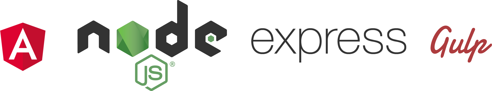

# Angular 2 Boilerplate with Gulp, Typescript, and Express  

Getting Started, grab the dependencies with:

`npm install`

then run

`gulp`

To run the server do this:

```shell
node dist/server.js
```
